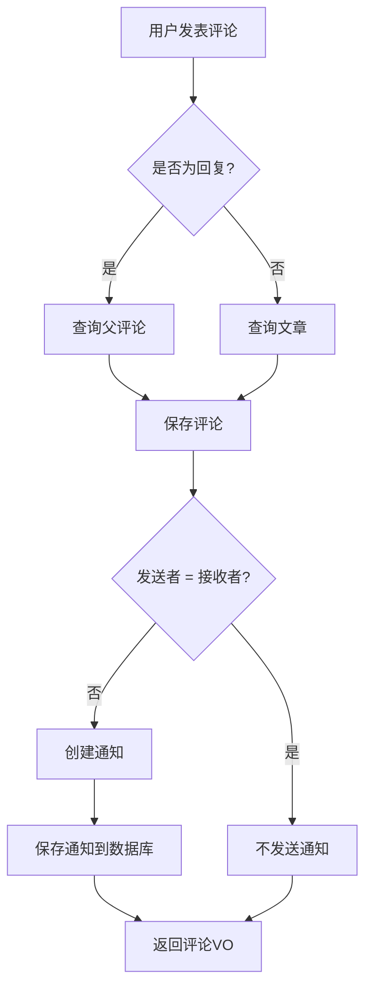
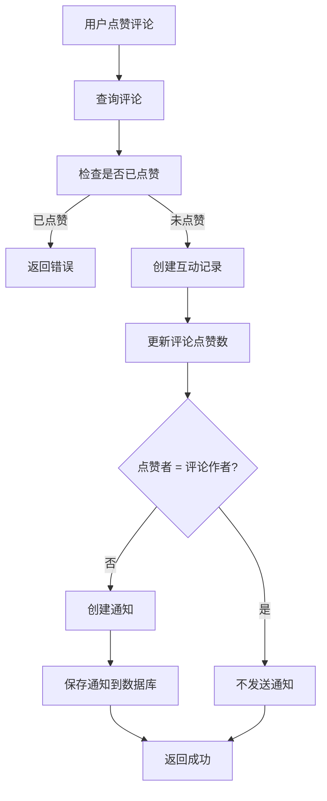
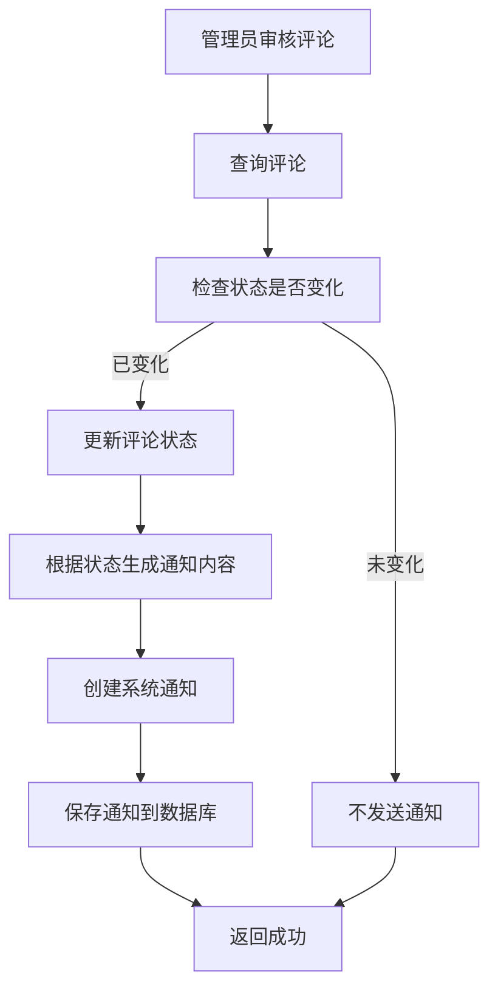

# 评论实时通知功能实现文档

> **完成时间**: 2025-10-15  
> **版本**: v1.0  
> **状态**: ✅ 已完成

---

## 📋 概述

本文档详细介绍了Horizon博客系统评论实时通知功能的实现，包括评论创建通知、评论回复通知、评论点赞通知和评论审核通知。

---

## ✨ 功能特性

### 1. 评论创建通知 ✅

**触发场景**：用户评论文章时

**通知对象**：文章作者

**通知内容**：
- 标题：`文章评论通知`
- 内容：`您的文章《文章标题》收到了新评论`
- 类型：`COMMENT`
- 关联ID：评论ID
- 发送者：评论用户ID

**特殊处理**：
- ❌ 自己评论自己的文章不发送通知
- ✅ 只有文章作者收到通知

---

### 2. 评论回复通知 ✅

**触发场景**：用户回复评论时

**通知对象**：原评论作者

**通知内容**：
- 标题：`评论回复通知`
- 内容：`您的评论收到了新的回复`
- 类型：`COMMENT`
- 关联ID：回复评论ID
- 发送者：回复用户ID

**特殊处理**：
- ❌ 自己回复自己的评论不发送通知
- ✅ 只有原评论作者收到通知

---

### 3. 评论点赞通知 ✅

**触发场景**：用户点赞评论时

**通知对象**：评论作者

**通知内容**：
- 标题：`评论点赞通知`
- 内容：`您的评论收到了新的点赞`
- 类型：`LIKE`
- 关联ID：评论ID
- 发送者：点赞用户ID

**特殊处理**：
- ❌ 自己点赞自己的评论不发送通知
- ✅ 只有评论作者收到通知

---

### 4. 评论审核通知 ✅

**触发场景**：管理员审核评论时

**通知对象**：评论作者

**通知内容**：
- 标题：`评论审核通知`
- 内容（动态）：
  - `APPROVED`: `您的评论已通过审核`
  - `REJECTED`: `您的评论未通过审核`
  - 其他：`您的评论状态已更新为：{status}`
- 类型：`SYSTEM`
- 关联ID：评论ID
- 发送者：null（系统通知）

**特殊处理**：
- ✅ 只有状态发生变化时才发送通知
- ✅ 评论作者收到系统通知

---

### 5. 文章点赞/收藏通知 ✅ (附加功能)

**触发场景**：用户点赞或收藏文章时

**通知对象**：文章作者

**点赞通知**：
- 标题：`文章点赞通知`
- 内容：`您的文章《文章标题》收到了新的点赞`
- 类型：`LIKE`

**收藏通知**：
- 标题：`文章收藏通知`
- 内容：`您的文章《文章标题》被收藏了`
- 类型：`FAVORITE`

---

## 🔧 技术实现

### 1. 集成通知服务

#### CommentServiceImpl 修改

**导入依赖**：
```java
import com.sunrizon.horizon.enums.NotificationType;
import com.sunrizon.horizon.pojo.Article;
import com.sunrizon.horizon.service.INotificationService;
```

**注入服务**：
```java
@Resource
private INotificationService notificationService;
```

**评论创建时发送通知**：
```java
// 保存评论后
Comment savedComment = commentRepository.save(comment);

// 发送通知
try {
  if (parentComment != null) {
    // 回复评论：通知父评论作者
    if (!parentComment.getUserId().equals(request.getUserId())) {
      notificationService.createNotification(
          parentComment.getUserId(),
          NotificationType.COMMENT,
          "评论回复通知",
          "您的评论收到了新的回复",
          savedComment.getCid(),
          request.getUserId()
      );
    }
  } else {
    // 文章评论：通知文章作者
    if (!article.getAuthorId().equals(request.getUserId())) {
      notificationService.createNotification(
          article.getAuthorId(),
          NotificationType.COMMENT,
          "文章评论通知",
          "您的文章《" + article.getTitle() + "》收到了新评论",
          savedComment.getCid(),
          request.getUserId()
      );
    }
  }
} catch (Exception e) {
  log.warn("发送评论通知失败: {}", e.getMessage());
}
```

**评论审核时发送通知**：
```java
CommentStatus oldStatus = comment.getStatus();
comment.setStatus(status);
commentRepository.saveAndFlush(comment);

// 只有状态发生变化时才发送通知
if (oldStatus != status) {
  String title = "评论审核通知";
  String content;
  if (status == CommentStatus.APPROVED) {
    content = "您的评论已通过审核";
  } else if (status == CommentStatus.REJECTED) {
    content = "您的评论未通过审核";
  } else {
    content = "您的评论状态已更新为：" + status.name();
  }
  notificationService.createNotification(
      comment.getUserId(),
      NotificationType.SYSTEM,
      title,
      content,
      cid,
      null // 系统通知无发送者
  );
}
```

---

### 2. InteractionServiceImpl 修改

**导入依赖**：
```java
import com.sunrizon.horizon.enums.NotificationType;
import com.sunrizon.horizon.service.INotificationService;
import lombok.extern.slf4j.Slf4j;
```

**注入服务**：
```java
@Resource
private INotificationService notificationService;
```

**点赞时发送通知**：
```java
// 保存互动记录后
Interaction saved = interactionRepository.saveAndFlush(interaction);

// 发送通知
try {
  if (type == InteractionType.LIKE) {
    if (InteractionTargetType.COMMENT.name().equals(targetType) && targetComment != null) {
      // 评论点赞通知
      if (!targetComment.getUserId().equals(userId)) {
        notificationService.createNotification(
            targetComment.getUserId(),
            NotificationType.LIKE,
            "评论点赞通知",
            "您的评论收到了新的点赞",
            targetId,
            userId
        );
      }
    } else if (InteractionTargetType.ARTICLE.name().equals(targetType) && targetArticle != null) {
      // 文章点赞通知
      if (!targetArticle.getAuthorId().equals(userId)) {
        notificationService.createNotification(
            targetArticle.getAuthorId(),
            NotificationType.LIKE,
            "文章点赞通知",
            "您的文章《" + targetArticle.getTitle() + "》收到了新的点赞",
            targetId,
            userId
        );
      }
    }
  } else if (type == InteractionType.FAVORITE && targetArticle != null) {
    // 文章收藏通知
    if (!targetArticle.getAuthorId().equals(userId)) {
      notificationService.createNotification(
          targetArticle.getAuthorId(),
          NotificationType.FAVORITE,
          "文章收藏通知",
          "您的文章《" + targetArticle.getTitle() + "》被收藏了",
          targetId,
          userId
      );
    }
  }
} catch (Exception e) {
  log.warn("发送互动通知失败: {}", e.getMessage());
}
```

---

## 📊 数据流程

### 1. 评论创建流程



### 2. 评论点赞流程



### 3. 评论审核流程



---

## 🗂️ 文件变更清单

### 修改文件 (2个)

| 文件路径 | 主要变更 | 新增代码行 |
|---------|---------|-----------|
| `service/impl/CommentServiceImpl.java` | 集成通知服务，添加评论创建/回复/审核通知 | +70 |
| `service/impl/InteractionServiceImpl.java` | 添加评论点赞/文章点赞/文章收藏通知 | +57 |

**总计**：新增约 **127行** 代码

---

## 🎯 通知类型映射

| 场景 | 通知类型 | 发送者 | 接收者 |
|------|---------|--------|--------|
| 用户评论文章 | COMMENT | 评论用户 | 文章作者 |
| 用户回复评论 | COMMENT | 回复用户 | 原评论作者 |
| 用户点赞评论 | LIKE | 点赞用户 | 评论作者 |
| 用户点赞文章 | LIKE | 点赞用户 | 文章作者 |
| 用户收藏文章 | FAVORITE | 收藏用户 | 文章作者 |
| 管理员审核评论 | SYSTEM | null（系统） | 评论作者 |

---

## 📱 API接口说明

评论通知功能本身不增加新的API接口，而是集成到现有的评论和互动接口中：

### 触发通知的API接口

| 接口 | 方法 | 触发通知类型 |
|------|------|-------------|
| `/api/comment` | POST | 评论创建通知 / 评论回复通知 |
| `/api/comment/{cid}/like` | POST | 评论点赞通知 |
| `/api/comment/{cid}/audit` | PATCH | 评论审核通知 |
| `/api/interaction/like/{articleId}` | POST | 文章点赞通知 |
| `/api/interaction/favorite/{articleId}` | POST | 文章收藏通知 |

### 查看通知的API接口

使用现有的通知系统接口：

| 接口 | 方法 | 说明 |
|------|------|------|
| `/api/notification` | GET | 获取所有通知（分页） |
| `/api/notification/unread` | GET | 获取未读通知（分页） |
| `/api/notification/count` | GET | 获取未读通知数量 |
| `/api/notification/{nid}` | PATCH | 标记通知为已读 |
| `/api/notification/mark-all-read` | POST | 标记所有通知为已读 |

---

## 🔒 安全措施

### 1. 防止自通知
- ✅ 用户评论自己的文章不发送通知
- ✅ 用户回复自己的评论不发送通知
- ✅ 用户点赞自己的评论/文章不发送通知

### 2. 异常处理
- ✅ 通知发送失败不影响核心业务
- ✅ 使用try-catch捕获异常并记录日志
- ✅ 通知失败时返回warn级别日志

### 3. 数据验证
- ✅ 检查文章/评论是否存在
- ✅ 检查用户ID有效性
- ✅ 检查状态变化（审核通知）

---

## 📈 性能优化建议

### 1. 异步通知发送 ⭐⭐⭐
**现状**：通知同步发送，可能影响响应时间

**优化方案**：
- 使用RabbitMQ异步发送通知
- 创建通知发送队列
- 异步处理通知创建

**实现示例**：
```java
// 发送消息到RabbitMQ
rabbitTemplate.convertAndSend(
    "notification.exchange",
    "notification.comment.create",
    notificationDTO
);
```

**预期效果**：
- 评论创建响应时间减少50-100ms
- 提升用户体验

---

### 2. 批量通知合并 ⭐⭐
**现状**：每次点赞都发送一条通知

**优化方案**：
- 短时间内多次点赞合并为一条通知
- 例如："您的评论收到了5个新点赞"

**实现思路**：
- 使用Redis缓存点赞次数
- 定时任务（每5分钟）批量发送通知

---

### 3. 通知优先级 ⭐
**现状**：所有通知同等重要

**优化方案**：
- 设置通知优先级（高/中/低）
- 高优先级：评论回复、审核结果
- 中优先级：评论点赞
- 低优先级：文章收藏

---

## 🧪 测试场景

### 场景1：用户评论文章
**步骤**：
1. 用户A登录
2. 用户A评论用户B的文章
3. 检查用户B的通知列表

**预期结果**：
- ✅ 用户B收到评论通知
- ✅ 通知内容包含文章标题
- ✅ 通知类型为COMMENT

---

### 场景2：用户回复评论
**步骤**：
1. 用户A登录
2. 用户A回复用户B的评论
3. 检查用户B的通知列表

**预期结果**：
- ✅ 用户B收到回复通知
- ✅ 通知内容为"您的评论收到了新的回复"
- ✅ 通知类型为COMMENT

---

### 场景3：用户点赞评论
**步骤**：
1. 用户A登录
2. 用户A点赞用户B的评论
3. 检查用户B的通知列表

**预期结果**：
- ✅ 用户B收到点赞通知
- ✅ 通知内容为"您的评论收到了新的点赞"
- ✅ 通知类型为LIKE

---

### 场景4：管理员审核评论
**步骤**：
1. 管理员登录
2. 审核用户A的评论为APPROVED
3. 检查用户A的通知列表

**预期结果**：
- ✅ 用户A收到审核通知
- ✅ 通知内容为"您的评论已通过审核"
- ✅ 通知类型为SYSTEM

---

### 场景5：自己评论自己的文章
**步骤**：
1. 用户A登录
2. 用户A评论自己的文章
3. 检查用户A的通知列表

**预期结果**：
- ✅ 用户A不收到任何通知（防止自通知）

---

## 💡 使用示例

### 示例1：评论文章触发通知

**请求**：
```http
POST /api/comment
Content-Type: application/json
Authorization: Bearer <user_token>

{
  "articleId": "article-123",
  "userId": "user-456",
  "content": "这篇文章写得真好！"
}
```

**后台处理**：
1. 创建评论记录
2. 查询文章作者（假设为user-789）
3. 检查 userId (user-456) != authorId (user-789)
4. 创建通知：
   - 接收者：user-789
   - 类型：COMMENT
   - 标题：文章评论通知
   - 内容：您的文章《XXX》收到了新评论

**用户user-789查看通知**：
```http
GET /api/notification/unread
Authorization: Bearer <user_789_token>
```

**响应**：
```json
{
  "code": 200,
  "data": {
    "content": [
      {
        "nid": "notif-001",
        "type": "COMMENT",
        "title": "文章评论通知",
        "content": "您的文章《XXX》收到了新评论",
        "isRead": false,
        "relatedId": "comment-999",
        "senderId": "user-456",
        "senderUsername": "UserA",
        "createdAt": "2025-10-15T12:30:00"
      }
    ]
  }
}
```

---

### 示例2：点赞评论触发通知

**请求**：
```http
POST /api/comment/comment-999/like
Authorization: Bearer <user_111_token>
```

**后台处理**：
1. 创建互动记录（点赞）
2. 查询评论作者（假设为user-456）
3. 检查 userId (user-111) != commentUserId (user-456)
4. 创建通知：
   - 接收者：user-456
   - 类型：LIKE
   - 标题：评论点赞通知
   - 内容：您的评论收到了新的点赞

**用户user-456收到通知**，可通过通知中心查看。

---

## 🚀 后续优化方向

### 短期（1周内）
1. **WebSocket实时推送** ⭐⭐⭐
   - 用户在线时实时推送通知
   - 避免需要刷新页面查看

2. **邮件通知** ⭐⭐
   - 用户可选择接收邮件通知
   - 重要通知（如审核结果）发送邮件

### 中期（1个月内）
1. **通知聚合** ⭐⭐
   - 相同类型通知合并显示
   - 例如："您收到了3条新评论"

2. **通知设置** ⭐
   - 用户可自定义接收哪些类型的通知
   - 通知频率设置（即时/每日摘要）

### 长期（2-3个月）
1. **智能通知** ⭐
   - 根据用户活跃度智能推送
   - 避免通知疲劳

2. **通知分析** ⭐
   - 统计通知打开率
   - 优化通知内容和时机

---

## 📝 总结

评论实时通知功能已完整实现，主要特点：

✅ **完整性**：覆盖评论创建、回复、点赞、审核全流程  
✅ **安全性**：防止自通知、异常处理完善  
✅ **易扩展**：基于现有通知系统，易于添加新类型  
✅ **用户友好**：及时反馈用户互动，提升参与度  

通知功能已集成到评论系统中，用户无需额外操作即可收到相关通知。

---

**文档版本**: 1.0  
**最后更新**: 2025-10-15  
**作者**: Qoder AI + Horizon Team
